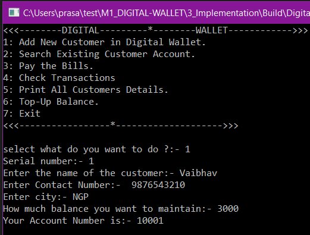
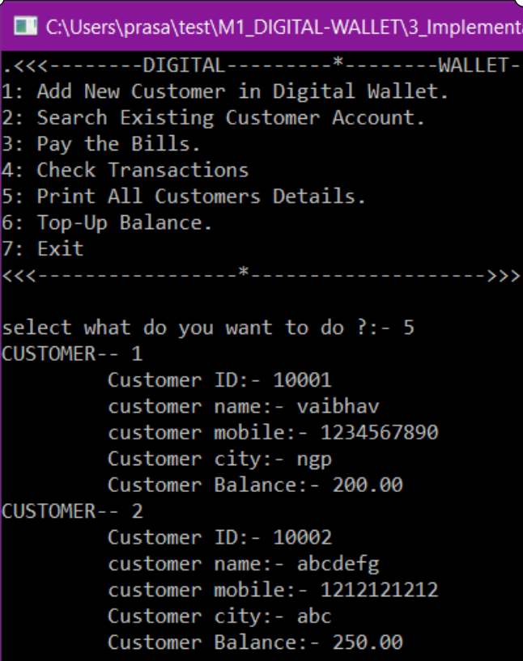
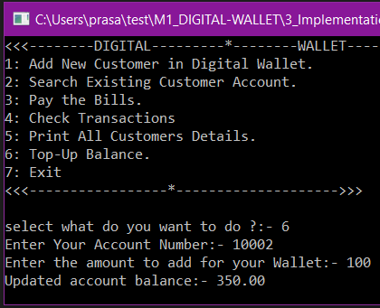

# Start window of the Digital Wallet

# Creating account for a New Customer

# Printing the information of a existing customer account

# Paying the Bills

# Check transactions

# Printing the information of all customers

# Adding balance to the customer's E-Wallet

